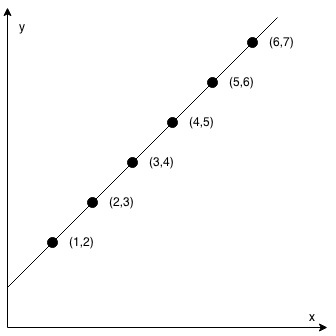
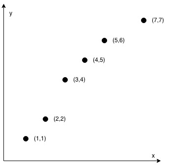

# 1232. [Check If It Is a Straight Line](https://leetcode.com/problems/check-if-it-is-a-straight-line/)

    Easy

#### Tags: Array, Math, Geometry

    
<b>Hint</b>

        hint here

You are given an array `coordinates`, `coordinates[i] = [x, y]`, where `[x, y]` represents the coordinate of a point.
Check if these points make a straight line in the XY plane.

#### Example 1:

<pre>
    <b>Input:</b> coordinates = [[1,2],[2,3],[3,4],[4,5],[5,6],[6,7]]
    <b>Output:</b> true
</pre>

#### Example 2:

<pre>
    <b>Input:</b> arr = [1,2,4]
    <b>Output:</b> false
    <b>Explanation:</b> There is no way to reorder the elements to obtain an arithmetic progression.
</pre>

#### Constraints:

* `2 <= arr.length <= 1000`
* <code> -106 <= arr[i] <= 106 </code>

| Accepted   | Submissions | Acceptance Rate |
|------------|-------------|-----------------|
| **203.7K** | **288.8K**  | **70.5%**       |

coordinates = [[1,2],[2,3],[3,4],[4,5],[5,6],[6,7]]