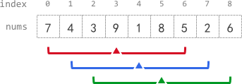

# 2090. [K Radius Subarray Averages](https://leetcode.com/problems/k-radius-subarray-averages/)

    Medium

#### Tags:

#### What's new?

    prefix
    Arrays.fill(averages, -1);

You are given a **0-indexed** array `nums` of `n` integers, and an integer `k`.

The **k-radius average** for a subarray of `nums` **centered** at some index `i` with the **radius** `k` is the average
of **all** elements in
`nums` between the indices `i - k` and `i + k` (**inclusive**). If there are less than `k` elements before or after the
index `i`,
then the **k-radius average** is `-1`.

Build and return _an array `avgs` of length `n` where `avgs[i]` is the **k-radius average** for the subarray centered at
index `i`_.

The **average** of `x` elements is the sum of the `x` elements divided by `x`, using **integer division**. The integer
division
truncates toward zero, which means losing its fractional part.

* For example, the average of four elements `2`, `3`, `1`, and `5` is `(2 + 3 + 1 + 5) / 4 = 11 / 4 = 2.75`, which
  truncates to `2`.

#### Example 1:

<pre>
<b>Input:</b> nums = [7,4,3,9,1,8,5,2,6], k = 3
<b>Output:</b> [-1,-1,-1,5,4,4,-1,-1,-1]
<b>Explanation:</b>
- avg[0], avg[1], and avg[2] are -1 because there are less than k elements before each index.
- The sum of the subarray centered at index 3 with radius 3 is: 7 + 4 + 3 + 9 + 1 + 8 + 5 = 37.
  Using integer division, avg[3] = 37 / 7 = 5.
- For the subarray centered at index 4, avg[4] = (4 + 3 + 9 + 1 + 8 + 5 + 2) / 7 = 4.
- For the subarray centered at index 5, avg[5] = (3 + 9 + 1 + 8 + 5 + 2 + 6) / 7 = 4.
- avg[6], avg[7], and avg[8] are -1 because there are less than k elements after each index.
</pre>

#### Example 2:

<pre>
<b>Input:</b> nums = [100000], k = 0
<b>Output:</b> [100000]
<b>Explanation:</b>
- The sum of the subarray centered at index 0 with radius 0 is: 100000.
  avg[0] = 100000 / 1 = 100000.
</pre>

#### Example 3:

<pre>
<b>Input:</b> nums = [8], k = 100000
<b>Output:</b> [-1]
<b>Explanation:</b>
- avg[0] is -1 because there are less than k elements before and after index 0.
</pre>

#### Constraints:

* n == nums.length
* 1 <= n <= 105
* 0 <= nums[i], k <= 105

| Accepted  | Submissions | Acceptance Rate |
|-----------|-------------|-----------------|
| **72.9K** | **150.6K**  | **48.4%**       |