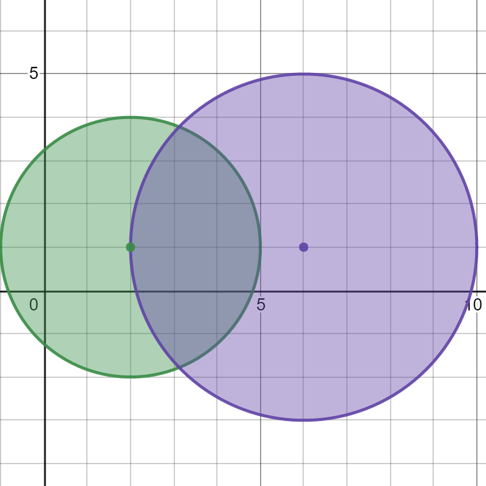
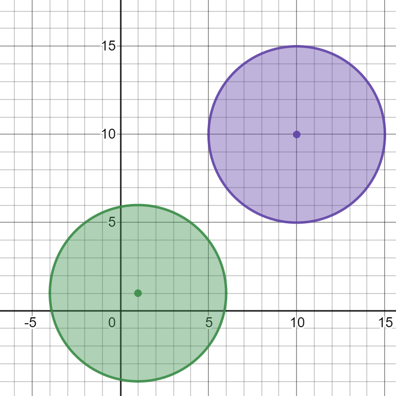
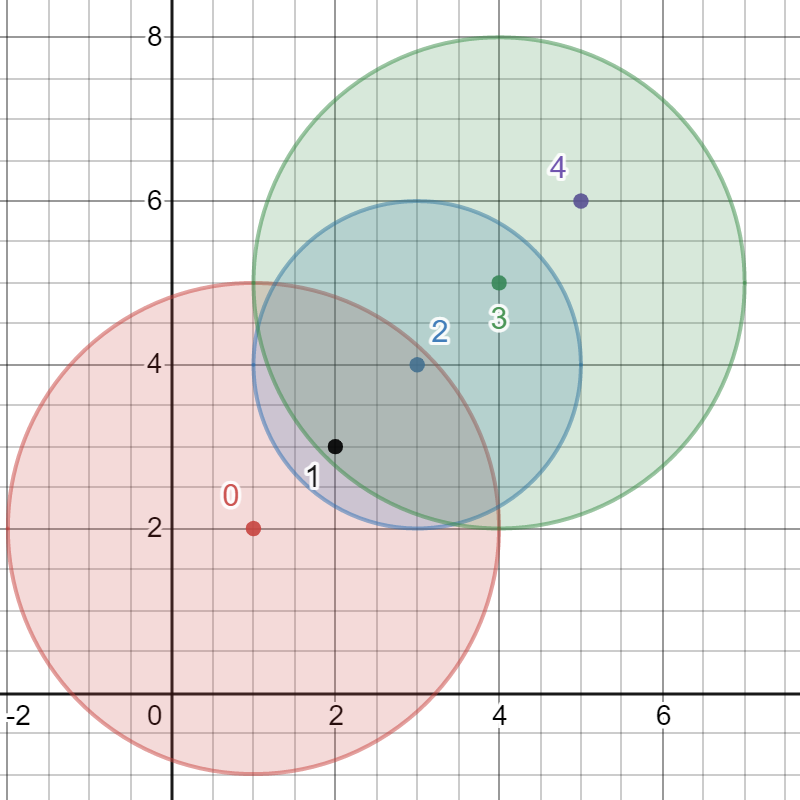

# 2101. [Detonate the Maximum Bombs](https://leetcode.com/problems/detonate-the-maximum-bombs/)

[//]: # (TODO: add difficult )

**Medium**

**Tags:** Graph, DFS

You are given a list of bombs. The **range** of a bomb is defined as the area where its effect can be felt. This area is
in the shape of a **circle** with the center as the location of the bomb.

The bombs are represented by a **0-indexed** 2D integer array `bombs` where <code>
bombs[i] = [xi, yi, ri]</code>. <code>xi</code> and
<code>yi</code> denote the X-coordinate and Y-coordinate of the location of the <code>ith</code>
bomb, whereas
<code>ri</code> denotes the **radius** of its range.

You may choose to detonate a **single** bomb. When a bomb is detonated, it will detonate **all bombs** that lie in its
range.
These bombs will further detonate the bombs that lie in their ranges.

Given the list of `bombs`, return _the **maximum** number of bombs that can be detonated if you are allowed to
detonate **only
one** bomb._

#### Example 1:

<pre>
<b>Input:</b> bombs = [[2,1,3],[6,1,4]]
<b>Output:</b> 2
<b>Explanation:</b>
The above figure shows the positions and ranges of the 2 bombs.
If we detonate the left bomb, the right bomb will not be affected.
But if we detonate the right bomb, both bombs will be detonated.
So the maximum bombs that can be detonated is max(1, 2) = 2.
</pre>

#### Example 2:

<pre>
<b>Input:</b> bombs = [[1,1,5],[10,10,5]]
<b>Output:</b> 1
<b>Explanation:</b>
Detonating either bomb will not detonate the other bomb, so the maximum number
of bombs that can be detonated is 1.
</pre>

#### Example 3:

<pre>
<b>Input:</b> bombs = [[1,2,3],[2,3,1],[3,4,2],[4,5,3],[5,6,4]]
<b>Output:</b> 5
<b>Explanation:</b>
The best bomb to detonate is bomb 0 because:

- Bomb 0 detonates bombs 1 and 2. The red circle denotes the range of bomb 0.
- Bomb 2 detonates bomb 3. The blue circle denotes the range of bomb 2.
- Bomb 3 detonates bomb 4. The green circle denotes the range of bomb 3.
  Thus all 5 bombs are detonated.
</pre>

#### Constraints:

* `1 <= bombs.length <= 100`
* `bombs[i].length == 3`
* <code> 1 <= xi, yi, ri <= 105 </code>

| Accepted  | Submissions | Acceptance Rate |
|-----------|-------------|-----------------|
| **73.9K** | **148.6K**  | **49.7%**       |

